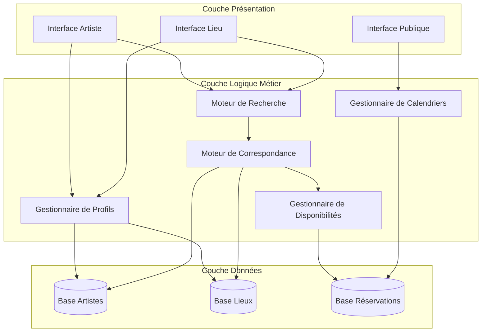

# Document de Conception

## Vue d'Ensemble

La plateforme de mise en relation artistes-lieux est un système web bidirectionnel qui facilite la découverte et la mise en relation entre artistes et lieux de performance/exposition. Le système utilise une architecture à trois niveaux (présentation, logique métier, données) avec un moteur de correspondance au cœur qui évalue la compatibilité technique et temporelle.

Le système sert trois types d'utilisateurs distincts avec des besoins différents:
- Les artistes cherchent des lieux compatibles pour compléter leur saison/tournée
- Les gestionnaires de lieux cherchent des artistes pour maximiser leur taux de réservation
- Le grand public consulte les calendriers de programmation

## Architecture

### Architecture Globale



### Principes Architecturaux

1. **Séparation des préoccupations**: Chaque composant a une responsabilité unique et bien définie
2. **Bidirectionnalité**: Le moteur de correspondance fonctionne de manière symétrique pour les recherches artiste→lieu et lieu→artiste
3. **Cohérence des données**: Les calculs de compatibilité produisent les mêmes résultats indépendamment de la direction de recherche
4. **Accessibilité publique**: Les calendriers sont accessibles sans authentification

## Composants et Interfaces

### Gestionnaire de Profils (ProfileManager)

Responsable de la création, modification et validation des profils artistes et lieux.

```typescript
interface ProfileManager {
  // Gestion des profils artistes
  createArtistProfile(data: ArtistProfileData): Result<ArtistProfile>
  updateArtistProfile(id: string, data: Partial<ArtistProfileData>): Result<ArtistProfile>
  getArtistProfile(id: string): Result<ArtistProfile>
  
  // Gestion des profils lieux
  createVenueProfile(data: VenueProfileData): Result<VenueProfile>
  updateVenueProfile(id: string, data: Partial<VenueProfileData>): Result<VenueProfile>
  getVenueProfile(id: string): Result<VenueProfile>
  
  // Validation
  validateProfileData(data: ProfileData): ValidationResult
}
```

### Moteur de Recherche (SearchEngine)

Orchestre les recherches et applique les filtres utilisateur.

```typescript
interface SearchEngine {
  // Recherche de lieux par un artiste
  searchVenuesForArtist(
    artistId: string,
    filters: VenueSearchFilters
  ): Result<VenueMatch[]>
  
  // Recherche d'artistes par un lieu
  searchArtistsForVenue(
    venueId: string,
    filters: ArtistSearchFilters
  ): Result<ArtistMatch[]>
  
  // Application des filtres
  applyFilters<T>(results: T[], filters: SearchFilters): T[]
}

interface VenueSearchFilters {
  dateRange?: DateRange
  location?: GeographicArea
  minCompatibilityScore?: number
}

interface ArtistSearchFilters {
  dateRange?: DateRange
  artType?: ArtType[]
  minCompatibilityScore?: number
}
```

### Moteur de Correspondance (MatchEngine)

Évalue la compatibilité technique et calcule les scores de correspondance.

```typescript
interface MatchEngine {
  // Évaluation de compatibilité
  evaluateCompatibility(
    artist: ArtistProfile,
    venue: VenueProfile
  ): CompatibilityResult
  
  // Calcul du score
  calculateCompatibilityScore(
    artistRequirements: TechnicalRequirements,
    venueCapabilities: TechnicalCapabilities
  ): number
  
  // Vérification des besoins individuels
  checkRequirement(
    requirement: TechnicalRequirement,
    capabilities: TechnicalCapabilities
  ): boolean
}

interface CompatibilityResult {
  isCompatible: boolean
  score: number
  unmatchedRequirements: TechnicalRequirement[]
}
```

### Gestionnaire de Disponibilités (AvailabilityManager)

Gère les périodes de disponibilité et identifie les chevauchements.

```typescript
interface AvailabilityManager {
  // Gestion des disponibilités
  addAvailability(userId: string, period: DateRange): Result<void>
  removeAvailability(userId: string, periodId: string): Result<void>
  getAvailabilities(userId: string): DateRange[]
  
  // Recherche de chevauchements
  findCommonAvailability(
    artistId: string,
    venueId: string
  ): DateRange[]
  
  // Vérification de conflits
  hasConflict(userId: string, period: DateRange): boolean
  
  // Marquage de périodes réservées
  markAsBooked(userId: string, period: DateRange): Result<void>
}
```

### Gestionnaire de Calendriers (CalendarManager)

Gère les calendriers publics et les événements confirmés.

```typescript
interface CalendarManager {
  // Récupération de calendriers
  getArtistCalendar(artistId: string): Event[]
  getVenueCalendar(venueId: string): Event[]
  
  // Gestion des événements
  addEvent(booking: Booking): Result<Event>
  removeEvent(eventId: string): Result<void>
  
  // Formatage pour affichage public
  formatEventForPublic(event: Event): PublicEvent
}
```

## Modèles de Données

### Profil Artiste

```typescript
interface ArtistProfile {
  id: string
  userId: string
  basicInfo: {
    name: string
    artType: ArtType
    description: string
    contactEmail: string
  }
  technicalRequirements: TechnicalRequirements
  availabilities: DateRange[]
  createdAt: Date
  updatedAt: Date
}

enum ArtType {
  MUSIC = "music",
  PERFORMANCE = "performance",
  SCULPTURE = "sculpture",
  PAINTING = "painting",
  PHOTOGRAPHY = "photography",
  MIXED_MEDIA = "mixed_media",
  OTHER = "other"
}

interface TechnicalRequirements {
  spaceRequirements: {
    minArea?: number  // en m²
    minHeight?: number  // en m
    indoorOutdoor?: "indoor" | "outdoor" | "both"
  }
  audioRequirements?: {
    soundSystem: boolean
    acousticTreatment?: boolean
    channels?: number
  }
  lightingRequirements?: {
    professionalLighting: boolean
    dimmable?: boolean
    colorCapable?: boolean
  }
  powerRequirements?: {
    voltage: number
    amperage: number
  }
  otherRequirements?: string[]
}
```

### Profil Lieu

```typescript
interface VenueProfile {
  id: string
  userId: string
  basicInfo: {
    name: string
    address: Address
    description: string
    contactEmail: string
    acceptedArtTypes: ArtType[]
  }
  technicalCapabilities: TechnicalCapabilities
  availabilities: DateRange[]
  createdAt: Date
  updatedAt: Date
}

interface Address {
  street: string
  city: string
  region: string
  country: string
  postalCode: string
  coordinates?: {
    latitude: number
    longitude: number
  }
}

interface TechnicalCapabilities {
  spaceCapabilities: {
    area: number  // en m²
    height: number  // en m
    type: "indoor" | "outdoor" | "both"
  }
  audioCapabilities?: {
    soundSystem: boolean
    acousticTreatment: boolean
    channels: number
  }
  lightingCapabilities?: {
    professionalLighting: boolean
    dimmable: boolean
    colorCapable: boolean
  }
  powerCapabilities?: {
    voltage: number
    amperage: number
  }
  otherCapabilities?: string[]
}
```

### Disponibilité et Réservation

```typescript
interface DateRange {
  id: string
  startDate: Date
  endDate: Date
}

interface Booking {
  id: string
  artistId: string
  venueId: string
  period: DateRange
  status: BookingStatus
  createdAt: Date
  confirmedAt?: Date
}

enum BookingStatus {
  PENDING = "pending",
  CONFIRMED = "confirmed",
  CANCELLED = "cancelled"
}

interface Event {
  id: string
  bookingId: string
  artistId: string
  venueId: string
  date: DateRange
  artistName: string
  venueName: string
  description?: string
}
```

### Résultats de Recherche

```typescript
interface VenueMatch {
  venue: VenueProfile
  compatibilityScore: number
  isCompatible: boolean
  commonAvailabilities: DateRange[]
  unmatchedRequirements: TechnicalRequirement[]
}

interface ArtistMatch {
  artist: ArtistProfile
  compatibilityScore: number
  isCompatible: boolean
  commonAvailabilities: DateRange[]
  unmatchedRequirements: TechnicalRequirement[]
}
```


## Propriétés de Correction

*Une propriété est une caractéristique ou un comportement qui doit être vrai pour toutes les exécutions valides d'un système - essentiellement, une déclaration formelle sur ce que le système devrait faire. Les propriétés servent de pont entre les spécifications lisibles par l'homme et les garanties de correction vérifiables par machine.*


### Propriétés de Persistance et Round-Trip

**Propriété 1: Round-trip des profils artistes**
*Pour tout* profil artiste valide avec ses informations de base et besoins techniques, créer le profil puis le récupérer devrait retourner un profil équivalent avec toutes les informations préservées.
**Valide: Exigences 1.1, 1.2**

**Propriété 2: Round-trip des profils lieux**
*Pour tout* profil lieu valide avec ses informations de base et capacités techniques, créer le profil puis le récupérer devrait retourner un profil équivalent avec toutes les informations préservées.
**Valide: Exigences 2.1, 2.2**

**Propriété 3: Mise à jour de disponibilité artiste**
*Pour tout* profil artiste existant et toute période de disponibilité valide, ajouter la disponibilité puis récupérer le profil devrait montrer la nouvelle disponibilité dans la liste.
**Valide: Exigences 1.3**

**Propriété 4: Mise à jour de disponibilité lieu**
*Pour tout* profil lieu existant et toute période de disponibilité valide, ajouter la disponibilité puis récupérer le profil devrait montrer la nouvelle disponibilité dans la liste.
**Valide: Exigences 2.3**

**Propriété 5: Round-trip des disponibilités**
*Pour tout* utilisateur et toute période de disponibilité, ajouter la période puis la récupérer devrait retourner les mêmes dates de début et de fin.
**Valide: Exigences 6.1**

**Propriété 6: Suppression de disponibilité**
*Pour tout* utilisateur et toute période de disponibilité existante, supprimer la période devrait résulter en son absence du profil lors de la récupération suivante.
**Valide: Exigences 6.2**

### Propriétés de Validation et Gestion d'Erreurs

**Propriété 7: Rejet des données invalides pour profils artistes**
*Pour toutes* données de profil artiste invalides (champs obligatoires manquants, formats incorrects), la tentative de création ou modification devrait échouer avec un message d'erreur descriptif.
**Valide: Exigences 1.4, 10.1, 10.3**

**Propriété 8: Rejet des données invalides pour profils lieux**
*Pour toutes* données de profil lieu invalides (champs obligatoires manquants, formats incorrects), la tentative de création ou modification devrait échouer avec un message d'erreur descriptif.
**Valide: Exigences 2.4, 10.1, 10.3**

**Propriété 9: Validation des périodes de disponibilité**
*Pour toute* période de disponibilité où la date de fin précède ou est égale à la date de début, la tentative d'ajout devrait échouer avec un message d'erreur.
**Valide: Exigences 10.2**

**Propriété 10: Prévention des conflits de réservation**
*Pour tout* utilisateur (artiste ou lieu) et toute nouvelle réservation qui chevauche une réservation existante confirmée, la tentative de création devrait échouer.
**Valide: Exigences 10.4**

### Propriétés de Compatibilité Technique

**Propriété 11: Symétrie de la compatibilité technique**
*Pour toute* paire (artiste, lieu), le résultat de compatibilité (compatible/incompatible et score) doit être identique que la recherche soit initiée par l'artiste ou par le lieu.
**Valide: Exigences 9.1**

**Propriété 12: Logique de compatibilité technique**
*Pour toute* paire (artiste, lieu), si tous les besoins techniques de l'artiste sont satisfaits par les capacités du lieu, alors la correspondance doit être marquée comme compatible; sinon, elle doit être marquée comme incompatible.
**Valide: Exigences 5.1, 5.2, 5.3**

**Propriété 13: Existence du score de compatibilité**
*Pour toute* paire (artiste, lieu) évaluée, un score de compatibilité numérique doit être calculé et présent dans le résultat.
**Valide: Exigences 5.4**

**Propriété 14: Besoins non satisfaits dans résultats incompatibles**
*Pour toute* paire (artiste, lieu) marquée comme incompatible, la liste des besoins non satisfaits doit être non vide et contenir exactement les besoins de l'artiste qui ne sont pas couverts par les capacités du lieu.
**Valide: Exigences 5.2**

### Propriétés de Recherche et Filtrage

**Propriété 15: Filtrage par compatibilité technique - recherche de lieux**
*Pour tout* artiste et toute recherche de lieux, tous les lieux retournés doivent être techniquement compatibles avec les besoins de l'artiste.
**Valide: Exigences 4.1**

**Propriété 16: Filtrage par compatibilité technique - recherche d'artistes**
*Pour tout* lieu et toute recherche d'artistes, tous les artistes retournés doivent être techniquement compatibles avec les capacités du lieu.
**Valide: Exigences 3.1**

**Propriété 17: Filtrage par disponibilité - recherche de lieux**
*Pour tout* artiste et toute recherche de lieux avec filtre de disponibilité, tous les lieux retournés doivent avoir au moins une période de disponibilité commune avec l'artiste pendant la plage spécifiée.
**Valide: Exigences 4.2**

**Propriété 18: Filtrage par disponibilité - recherche d'artistes**
*Pour tout* lieu et toute recherche d'artistes avec filtre de disponibilité, tous les artistes retournés doivent avoir au moins une période de disponibilité commune avec le lieu pendant la plage spécifiée.
**Valide: Exigences 3.2**

**Propriété 19: Filtrage par type d'art**
*Pour tout* lieu et toute recherche d'artistes avec filtre de type d'art, tous les artistes retournés doivent avoir un type d'art correspondant au filtre spécifié.
**Valide: Exigences 3.3**

**Propriété 20: Filtrage par localisation géographique**
*Pour tout* artiste et toute recherche de lieux avec filtre géographique, tous les lieux retournés doivent être situés dans la zone géographique spécifiée.
**Valide: Exigences 4.3**

**Propriété 21: Tri des résultats par score de compatibilité**
*Pour toute* recherche (artiste→lieu ou lieu→artiste), les résultats retournés doivent être triés par score de compatibilité en ordre décroissant.
**Valide: Exigences 5.5**

**Propriété 22: Exclusion des correspondances sans disponibilité commune**
*Pour toute* paire (artiste, lieu) sans aucune période de disponibilité commune, cette paire ne doit pas apparaître dans les résultats de recherche.
**Valide: Exigences 6.4**

**Propriété 23: Complétude des informations dans résultats - profils artistes**
*Pour tout* résultat de recherche d'artiste affiché, le rendu doit contenir au minimum le nom, le type d'art, la description et les informations de contact de l'artiste.
**Valide: Exigences 3.4**

**Propriété 24: Complétude des informations dans résultats - profils lieux**
*Pour tout* résultat de recherche de lieu affiché, le rendu doit contenir au minimum le nom, l'adresse, la description et les informations de contact du lieu.
**Valide: Exigences 4.4**

### Propriétés de Disponibilité et Réservation

**Propriété 25: Calcul des disponibilités communes**
*Pour toute* paire (artiste, lieu), les disponibilités communes calculées doivent être exactement l'intersection des périodes de disponibilité de l'artiste et du lieu.
**Valide: Exigences 6.3**

**Propriété 26: Marquage des périodes réservées**
*Pour toute* réservation confirmée, la période réservée doit être marquée comme non disponible pour l'artiste et le lieu, et ne doit plus apparaître dans leurs disponibilités respectives.
**Valide: Exigences 6.5**

### Propriétés des Calendriers Publics

**Propriété 27: Complétude du calendrier artiste**
*Pour tout* artiste, le calendrier public doit contenir exactement tous les événements avec statut "confirmé" associés à cet artiste, ni plus ni moins.
**Valide: Exigences 7.1**

**Propriété 28: Complétude du calendrier lieu**
*Pour tout* lieu, le calendrier public doit contenir exactement tous les événements avec statut "confirmé" associés à ce lieu, ni plus ni moins.
**Valide: Exigences 8.1**

**Propriété 29: Complétude des informations d'événement - calendrier artiste**
*Pour tout* événement affiché dans un calendrier artiste, le rendu doit contenir la date, le nom du lieu et les informations de base de l'événement.
**Valide: Exigences 7.2**

**Propriété 30: Complétude des informations d'événement - calendrier lieu**
*Pour tout* événement affiché dans un calendrier lieu, le rendu doit contenir la date, le nom de l'artiste et les informations de base de l'événement.
**Valide: Exigences 8.2**

**Propriété 31: Tri chronologique des calendriers artistes**
*Pour tout* calendrier artiste, les événements doivent être triés par date de début en ordre chronologique croissant.
**Valide: Exigences 7.3**

**Propriété 32: Tri chronologique des calendriers lieux**
*Pour tout* calendrier lieu, les événements doivent être triés par date de début en ordre chronologique croissant.
**Valide: Exigences 8.3**

**Propriété 33: Ajout d'événement au calendrier artiste**
*Pour toute* réservation nouvellement confirmée, un événement correspondant doit apparaître immédiatement dans le calendrier public de l'artiste.
**Valide: Exigences 7.4**

**Propriété 34: Ajout d'événement au calendrier lieu**
*Pour toute* réservation nouvellement confirmée, un événement correspondant doit apparaître immédiatement dans le calendrier public du lieu.
**Valide: Exigences 8.4**

**Propriété 35: Retrait d'événement du calendrier artiste**
*Pour tout* événement annulé, cet événement ne doit plus apparaître dans le calendrier public de l'artiste.
**Valide: Exigences 7.5**

**Propriété 36: Retrait d'événement du calendrier lieu**
*Pour tout* événement annulé, cet événement ne doit plus apparaître dans le calendrier public du lieu.
**Valide: Exigences 8.5**


## Gestion des Erreurs

### Stratégie Générale

Le système utilise un type `Result<T>` pour la gestion explicite des erreurs, permettant de distinguer clairement les succès des échecs sans exceptions.

```typescript
type Result<T> = 
  | { success: true; data: T }
  | { success: false; error: ErrorDetails }

interface ErrorDetails {
  code: ErrorCode
  message: string
  field?: string  // Pour les erreurs de validation
  details?: Record<string, any>
}

enum ErrorCode {
  // Erreurs de validation
  VALIDATION_ERROR = "VALIDATION_ERROR",
  MISSING_REQUIRED_FIELD = "MISSING_REQUIRED_FIELD",
  INVALID_DATE_RANGE = "INVALID_DATE_RANGE",
  INVALID_FORMAT = "INVALID_FORMAT",
  
  // Erreurs de conflit
  BOOKING_CONFLICT = "BOOKING_CONFLICT",
  AVAILABILITY_CONFLICT = "AVAILABILITY_CONFLICT",
  
  // Erreurs de ressource
  NOT_FOUND = "NOT_FOUND",
  ALREADY_EXISTS = "ALREADY_EXISTS",
  
  // Erreurs système
  DATABASE_ERROR = "DATABASE_ERROR",
  INTERNAL_ERROR = "INTERNAL_ERROR"
}
```

### Catégories d'Erreurs

#### 1. Erreurs de Validation

Surviennent lors de la soumission de données invalides:

- **Champs obligatoires manquants**: Retourne `MISSING_REQUIRED_FIELD` avec le nom du champ
- **Format invalide**: Retourne `INVALID_FORMAT` pour les emails, numéros, etc.
- **Plage de dates invalide**: Retourne `INVALID_DATE_RANGE` si date de fin ≤ date de début
- **Valeurs hors limites**: Retourne `VALIDATION_ERROR` pour les valeurs numériques invalides

Exemple:
```typescript
{
  success: false,
  error: {
    code: "INVALID_DATE_RANGE",
    message: "La date de fin doit être postérieure à la date de début",
    field: "dateRange",
    details: { startDate: "2024-01-15", endDate: "2024-01-10" }
  }
}
```

#### 2. Erreurs de Conflit

Surviennent lors de tentatives d'opérations conflictuelles:

- **Conflit de réservation**: Retourne `BOOKING_CONFLICT` si la période chevauche une réservation existante
- **Conflit de disponibilité**: Retourne `AVAILABILITY_CONFLICT` si l'opération viole les contraintes de disponibilité

Exemple:
```typescript
{
  success: false,
  error: {
    code: "BOOKING_CONFLICT",
    message: "Une réservation existe déjà pour cette période",
    details: {
      conflictingBookingId: "booking-123",
      requestedPeriod: { start: "2024-01-15", end: "2024-01-20" },
      existingPeriod: { start: "2024-01-18", end: "2024-01-25" }
    }
  }
}
```

#### 3. Erreurs de Ressource

Surviennent lors d'opérations sur des ressources inexistantes ou dupliquées:

- **Ressource non trouvée**: Retourne `NOT_FOUND` si l'ID n'existe pas
- **Ressource déjà existante**: Retourne `ALREADY_EXISTS` pour les tentatives de création de doublons

#### 4. Erreurs Système

Erreurs internes du système:

- **Erreur de base de données**: Retourne `DATABASE_ERROR` pour les problèmes de persistance
- **Erreur interne**: Retourne `INTERNAL_ERROR` pour les erreurs inattendues

### Gestion des Cas Limites

#### Recherches sans résultats

Lorsqu'une recherche ne retourne aucun résultat:
- Retourne un succès avec une liste vide
- L'interface utilisateur affiche un message approprié
- Suggère d'élargir les critères de recherche

#### Profils incomplets

Lorsqu'un profil manque d'informations optionnelles:
- Permet la création/modification
- Avertit l'utilisateur que le profil peut être moins visible dans les recherches
- Calcule un score de complétude du profil

#### Disponibilités fragmentées

Lorsque les disponibilités sont très fragmentées:
- Calcule toutes les intersections possibles
- Présente les résultats groupés par période
- Permet le filtrage par durée minimale

## Stratégie de Test

### Approche Duale de Test

Le système utilise une approche combinant tests unitaires et tests basés sur les propriétés pour une couverture complète:

- **Tests unitaires**: Vérifient des exemples spécifiques, cas limites et conditions d'erreur
- **Tests basés sur les propriétés**: Vérifient les propriétés universelles sur de nombreuses entrées générées

Ces deux approches sont complémentaires et nécessaires pour une couverture complète.

### Configuration des Tests Basés sur les Propriétés

#### Bibliothèque Recommandée

Pour TypeScript/JavaScript: **fast-check**

```typescript
import * as fc from 'fast-check'
```

#### Configuration Standard

Chaque test basé sur les propriétés doit:
- Exécuter un minimum de 100 itérations
- Être annoté avec un commentaire référençant la propriété du document de conception
- Format d'annotation: `// Feature: artist-venue-matching, Property {number}: {texte de la propriété}`

Exemple:
```typescript
// Feature: artist-venue-matching, Property 1: Round-trip des profils artistes
it('should preserve all artist profile data through create-retrieve cycle', () => {
  fc.assert(
    fc.property(
      artistProfileArbitrary,
      (profile) => {
        const created = profileManager.createArtistProfile(profile)
        expect(created.success).toBe(true)
        
        const retrieved = profileManager.getArtistProfile(created.data.id)
        expect(retrieved.success).toBe(true)
        expect(retrieved.data).toEqual(created.data)
      }
    ),
    { numRuns: 100 }
  )
})
```

### Générateurs de Données (Arbitraries)

#### Générateurs de Base

```typescript
// Générateur de type d'art
const artTypeArbitrary = fc.constantFrom(
  ArtType.MUSIC,
  ArtType.PERFORMANCE,
  ArtType.SCULPTURE,
  ArtType.PAINTING,
  ArtType.PHOTOGRAPHY,
  ArtType.MIXED_MEDIA,
  ArtType.OTHER
)

// Générateur de plage de dates valide
const dateRangeArbitrary = fc.tuple(
  fc.date({ min: new Date('2024-01-01'), max: new Date('2025-12-31') }),
  fc.integer({ min: 1, max: 30 })
).map(([start, durationDays]) => ({
  id: fc.uuid(),
  startDate: start,
  endDate: new Date(start.getTime() + durationDays * 24 * 60 * 60 * 1000)
}))

// Générateur de besoins techniques
const technicalRequirementsArbitrary = fc.record({
  spaceRequirements: fc.record({
    minArea: fc.option(fc.integer({ min: 10, max: 1000 })),
    minHeight: fc.option(fc.integer({ min: 2, max: 20 })),
    indoorOutdoor: fc.option(fc.constantFrom('indoor', 'outdoor', 'both'))
  }),
  audioRequirements: fc.option(fc.record({
    soundSystem: fc.boolean(),
    acousticTreatment: fc.option(fc.boolean()),
    channels: fc.option(fc.integer({ min: 2, max: 64 }))
  })),
  lightingRequirements: fc.option(fc.record({
    professionalLighting: fc.boolean(),
    dimmable: fc.option(fc.boolean()),
    colorCapable: fc.option(fc.boolean())
  })),
  powerRequirements: fc.option(fc.record({
    voltage: fc.constantFrom(110, 220, 240),
    amperage: fc.integer({ min: 10, max: 200 })
  }))
})

// Générateur de profil artiste
const artistProfileArbitrary = fc.record({
  basicInfo: fc.record({
    name: fc.string({ minLength: 1, maxLength: 100 }),
    artType: artTypeArbitrary,
    description: fc.string({ minLength: 10, maxLength: 500 }),
    contactEmail: fc.emailAddress()
  }),
  technicalRequirements: technicalRequirementsArbitrary,
  availabilities: fc.array(dateRangeArbitrary, { minLength: 0, maxLength: 10 })
})
```

#### Générateurs pour Cas Limites

```typescript
// Générateur de données invalides pour tests d'erreur
const invalidArtistProfileArbitrary = fc.oneof(
  // Champs obligatoires manquants
  fc.record({
    basicInfo: fc.record({
      name: fc.constant(''),  // Nom vide
      artType: artTypeArbitrary,
      description: fc.string(),
      contactEmail: fc.emailAddress()
    }),
    technicalRequirements: technicalRequirementsArbitrary,
    availabilities: fc.array(dateRangeArbitrary)
  }),
  // Email invalide
  fc.record({
    basicInfo: fc.record({
      name: fc.string({ minLength: 1 }),
      artType: artTypeArbitrary,
      description: fc.string(),
      contactEmail: fc.constant('not-an-email')
    }),
    technicalRequirements: technicalRequirementsArbitrary,
    availabilities: fc.array(dateRangeArbitrary)
  })
)

// Générateur de plages de dates invalides
const invalidDateRangeArbitrary = fc.tuple(
  fc.date(),
  fc.integer({ min: -30, max: -1 })
).map(([start, negativeDays]) => ({
  startDate: start,
  endDate: new Date(start.getTime() + negativeDays * 24 * 60 * 60 * 1000)
}))
```

### Organisation des Tests

#### Structure des Suites de Tests

```
tests/
├── unit/
│   ├── profile-manager.test.ts
│   ├── search-engine.test.ts
│   ├── match-engine.test.ts
│   ├── availability-manager.test.ts
│   └── calendar-manager.test.ts
├── property/
│   ├── profile-roundtrip.property.test.ts
│   ├── validation.property.test.ts
│   ├── compatibility.property.test.ts
│   ├── search-filtering.property.test.ts
│   ├── availability.property.test.ts
│   └── calendar.property.test.ts
├── integration/
│   ├── artist-venue-matching.integration.test.ts
│   └── booking-flow.integration.test.ts
└── arbitraries/
    ├── profile.arbitraries.ts
    ├── date.arbitraries.ts
    └── technical.arbitraries.ts
```

#### Équilibre Tests Unitaires vs Tests de Propriétés

**Tests unitaires** - Focus sur:
- Exemples spécifiques démontrant le comportement correct
- Cas limites identifiés (listes vides, valeurs nulles, etc.)
- Conditions d'erreur spécifiques
- Points d'intégration entre composants

**Tests de propriétés** - Focus sur:
- Propriétés universelles (round-trip, symétrie, invariants)
- Couverture exhaustive des entrées via génération aléatoire
- Validation des règles métier sur de nombreux cas
- Détection de bugs sur des cas non anticipés

**Règle d'équilibre**: Éviter trop de tests unitaires - les tests de propriétés gèrent la couverture de nombreuses entrées. Les tests unitaires doivent se concentrer sur des exemples spécifiques et des cas limites.

### Mapping Tests → Propriétés

Chaque propriété de correction doit être implémentée par UN SEUL test basé sur les propriétés. Exemples:

| Propriété | Test Correspondant | Fichier |
|-----------|-------------------|---------|
| Propriété 1: Round-trip profils artistes | `should preserve all artist profile data through create-retrieve cycle` | `profile-roundtrip.property.test.ts` |
| Propriété 11: Symétrie compatibilité | `should return same compatibility result regardless of search direction` | `compatibility.property.test.ts` |
| Propriété 21: Tri par score | `should return search results sorted by compatibility score descending` | `search-filtering.property.test.ts` |

### Stratégie de Test par Composant

#### ProfileManager
- **Tests unitaires**: Validation de champs spécifiques, messages d'erreur
- **Tests de propriétés**: Round-trip (Propriétés 1, 2), validation (Propriétés 7, 8)

#### MatchEngine
- **Tests unitaires**: Exemples de compatibilité/incompatibilité spécifiques
- **Tests de propriétés**: Symétrie (Propriété 11), logique de compatibilité (Propriété 12)

#### SearchEngine
- **Tests unitaires**: Recherches avec résultats vides, filtres combinés
- **Tests de propriétés**: Filtrage (Propriétés 15-20), tri (Propriété 21)

#### AvailabilityManager
- **Tests unitaires**: Détection de chevauchements spécifiques
- **Tests de propriétés**: Intersection (Propriété 25), conflits (Propriété 10)

#### CalendarManager
- **Tests unitaires**: Formatage d'événements, gestion des annulations
- **Tests de propriétés**: Complétude (Propriétés 27, 28), tri (Propriétés 31, 32)

### Couverture de Code

Objectifs de couverture:
- **Couverture des lignes**: Minimum 80%
- **Couverture des branches**: Minimum 75%
- **Couverture des fonctions**: Minimum 90%

Les tests de propriétés contribuent significativement à la couverture en explorant de nombreux chemins d'exécution.

### Tests d'Intégration

En plus des tests unitaires et de propriétés, des tests d'intégration vérifient:
- Le flux complet de recherche et correspondance
- Le flux de réservation de bout en bout
- L'interaction entre calendriers et disponibilités
- La cohérence des données entre composants

Ces tests utilisent des données réalistes et vérifient que tous les composants fonctionnent ensemble correctement.
